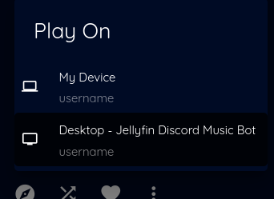
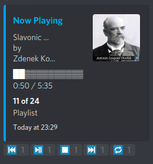

# Jellyfin Discord Music Bot

Jellyfin Discord Music Bot is a Discord Bot for the [Jellyfin Media Server!](http://github.com/jellyfin/jellyfin)

## Capabilities

### Play to

Just `summon` the Bot into your Channel, than choose the Bot in Jellyfin as the Device you want to cast to



 and start playing you favourite Music

### Interactive Play Message

When you start playing something you can easily controll the Bot with just clicking on the Buttons under the Play Message



### Commands

Beware that you'll always need to add your prefix(default: ?) in front of the command.

Command | Description
------------ | -------------
summon | Join the channel the author of the message(now you can cast to the Bot from within Jellyfin)
disconnect | Disconnect from all current Voice Channels
play | Play the following item(can be the name of the song or the Stream URL)
add | Add the following item to the current playlist
pause/resume | Pause/Resume audio
seek | Where to Seek to in seconds or MM:SS
skip | Skip this Song
spawn | Spawns an Interactive Play Controller
help | Display the help message

### Limitations
- No Playlist Repeat Mode.
- Multi Server support.
- [Playing Video Content](https://support.discord.com/hc/en-us/community/posts/360059238512-Add-Go-Live-support-for-API) (if Discord ever adds this, I'll implement it into this Bot)

## Getting Started
You'll need a Discord Application for this Bot to work, as you will host it yourself.

[How to retrieve your token](https://discordjs.guide/preparations/setting-up-a-bot-application.html#creating-your-bot)

[How to invite the Bot to your server](https://discordjs.guide/preparations/adding-your-bot-to-servers.html#bot-invite-links)

[Generate an Api and bot here](https://discord.com/developers/applications/). 

Click New Application. 


The Name of the application will be the bot's name.


Go to the Bot tab.


Generate the bot, and grab the token. Also, recommend making the bot private.


Go to the OAuth2 page, click Bot Scope to get the url authorization link.


Authorize your room!


### The simplest way to get started is using Docker:

```bash
docker run -d \
    --name jellyfin-discord-music-bot \
    -e DISCORD_PREFIX="?" \
    -e DISCORD_TOKEN="yourtokengoeshere" \
    -e JELLYFIN_SERVER_ADDRESS="https://jellyfin.DOMAIN" \
    -e JELLYFIN_USERNAME="" \
    -e JELLYFIN_PASSWORD="" \
    -e JELLYFIN_APP_NAME="Jellyfin Discord Music Bot" \
    -e MESSAGE_UPDATE_INTERVAL="2000" \
    --restart unless-stopped \
    kgt1/jellyfin-discord-music-bot
```

MESSAGE_UPDATE_INTERVAL is the amount of time in ms the play message gets updated with the current time

### Alternatively you can run the Application natively with NodeJS:

Dependencies:

- npm 6.14.6
- NodeJS v12.18.3
- ffmpeg 4.2.4
```bash
git clone https://github.com/kgt1/jellyfin-discord-music-bot.git
cd jellyfin-discord-music-bot
npm install
```
edit config.json and add your token,server-address etc.
```bash
npm run start
```


## How to build
```
git clone https://github.com/kgt1/jellyfin-discord-music-bot.git
cd jellyfin-discord-music-bot
docker build -t YOUR_IMAGE_NAME .
```
